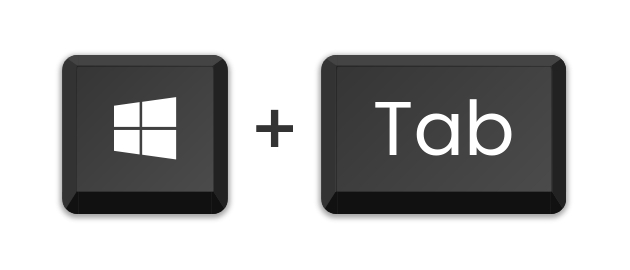
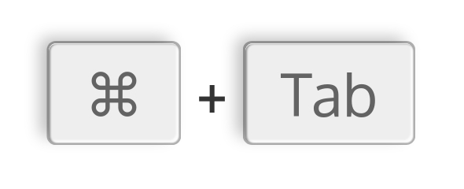

<h1 align='center'>Key2Img</h1>

Convert Keyboard Shortcuts To Image Just In Few Seconds!

  
  
  
  

---

# Preview

These are some images generated by Key2Img

---

# Options

- Output:
  - PNG
  - JPEG
- Fonts:
  - More than 44 Fonts are available
  - More fonts can be added and used from [Google Fonts](https://fonts.google.com)

---

# Todo
- Adding modals instead of using inbuilt browser functions like `prompt`.
- Adding more customization options. (example - BG Color, Text Color, Shadow Color and Toggle Shadow on/off).
- Adding more key themes.

---

# Support
You can support the development of this project by making more people aware of this Service.

---

# Bugs
Currently i don't know any bugs but if you face any bug you can raise a [Issue Here](https://github.com/Key2img/Source/issues/new)

---

# Thanks
