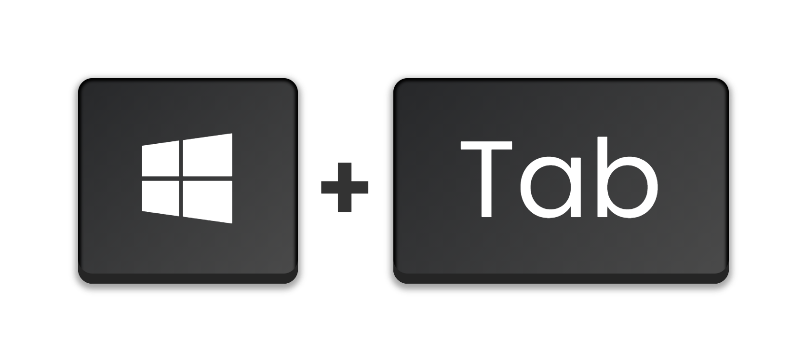
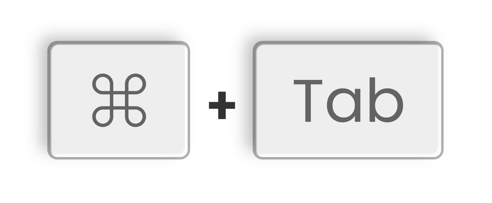

# key2Img
Keyboard Shortcuts To Image Just In Few Seconds!

---

# Introduction
Have you seen those images of Keyboard shortcuts, in Videos or Photos?
Yea you can make that in few seconds without any Editing Skills Needed!

---
# Preview
* Laptop Keyboard Styled

* Mac/Apple Keyboard Styled

---
# Tutorial

---
# Todo
* Add More Image Export Formats (Currently Jpeg, Png Are Available)
* Adding A Dark Theme For the Website
* Adding More Keyboard Themes
* Adding A Loader When Image is Being Processed

# No Known Bugs

---

# Fixed Bugs
* Fixed Jpeg Scaling Issue (Scale doesn't Work when exporting Jpeg is fixed)

---
# Help Us By
**Reporting Bugs [Here](https://github.com/Key2img/Key2Img/issues/new)** Or **Contributing To Our Project [Here](https://github.com/Key2img/Key2Img/pulls)**

---

# Thanks!
